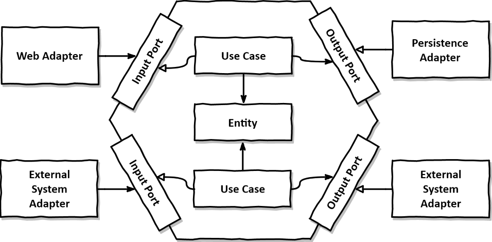

# error-notifier
> 실시간 장애 알림 서비스


error-notifier는 **알림 대상 목록, 심각도, 장애 내용을 전달 받아 외부 서비스로 장애 알림 메시지를 전송**하기 위한 서비스입니다.

**멀티 모듈 프로젝트**로, 다음 모듈로 구성됩니다.

1. `common` : 모듈 공통 Utils, DTO 정의
2. `producer` : 장애 알림 전송 요청을 받아 대상자 및 외부 서비스 요청에 필요한 token, channelId를 조회하여 알림 전송 event 발행
3. `consumer` : 알림 전송 event를 구독하여 외부 서비스 메시지 전송 API 호출
4. `mockup` : 외부 서비스 mockup

<br>

---

## 실행 방법

Docker 실행 후 프로젝트 root 디렉토리에서 다음 명령어를 차례로 입력하여 실행할 수 있습니다.

```
./gradlew build

docker compose up
```

<br>

---

## 기술 스택

- Language : `Java 21 (LTS)`
- Framework : `Spring Boot 3.3.3`, `JUnit5`
- DB : `H2`, `Spring Data JPA`, `Flyway`
- ETC : `Kafka`, `Log4J2`, `OpenFeign`, `Docker`

<br>

---

## 시스템 아키텍처

장애 알림 메시지 전송 **API 처리량을 높이기 위한 고려**, **서비스 확장에 대한 고려**로 인하여 Queue를 사용한 비동기 아키텍처를 구성했습니다.

해당 아키텍처는 다음과 같은 장점을 같습니다.

- 장애 발생 시 Kafka에 적재된 데이터는 손실되지 않아 재처리가 가능합니다.
- Producer 모듈은 Slack 등 외부 서비스의 병목과 관계 없이 알림 대상 및 정보를 조회하여 이벤트를 발행하여 처리량을 늘릴 수 있습니다.
- 각 모듈의 독립성이 증가하며 scale out이 용이합니다.
- 추가적인 서비스를 추가해 event를 구독하여 확장 가능합니다.

<br>

---

## 소프트웨어 아키텍처



클린 아키텍처를 지향하기 위하여 **헥사고날 아키텍처**를 사용했으며 **모든 의존성 방향은 Domain**으로 흐릅니다.

> - Input: `Input Adpater` -(`Input Port`)> `Application Service` -> `Domain`
> - Output: `Domain` <- `Application Service` <(`Output Port`)- `Output Adapter`

**domain은 infrastructure의 어떤 의존성도 가지지 않으며**, domain과 infrastructure는 port & adapter로 분리되어 있기 때문에 **외부 의존성을 domain 코드 변경 없이 쉽게 교체**할 수 있습니다.

만약 외부 의존성의 변경 혹은 로직의 변경이 필요하다면 adpater만 갈아 끼우거나, adapter의 코드만 수정합니다.

간략한 디렉토리 구조는 다음과 같습니다. (producer 모듈 예시)

```
producer
├── common
│   ├── config
│   └── web
│       ├── aop
│       ├── exception
│       └── filter
└── notification
    ├── adapter
    │   ├── in
    │   │   └── web
    │   │       └── dto
    │   └── out
    │       ├── persistence
    │       │   └── jpa
    │       │       ├── entity
    │       │       └── repository
    │       └── queue
    │           └── kafka
    ├── application
    │   ├── in
    │   │   └── command
    │   └── out
    └── domain
```

<br>

---

## DB 스키마

<br>

---

## API 명세

<br>

---

## 주요 라이브러리 및 오픈소스

<br>

---

## 기타 구현

- GTID를 포함한 request, response 및 각종 에러 및 정보 logging
- AOP를 사용한 공통 Response Format 처리
- CustomException, ExceptionHandler를 사용한 Exception 처리 단순화
- 통합 테스트 및 유닛 테스트

<br>

---

