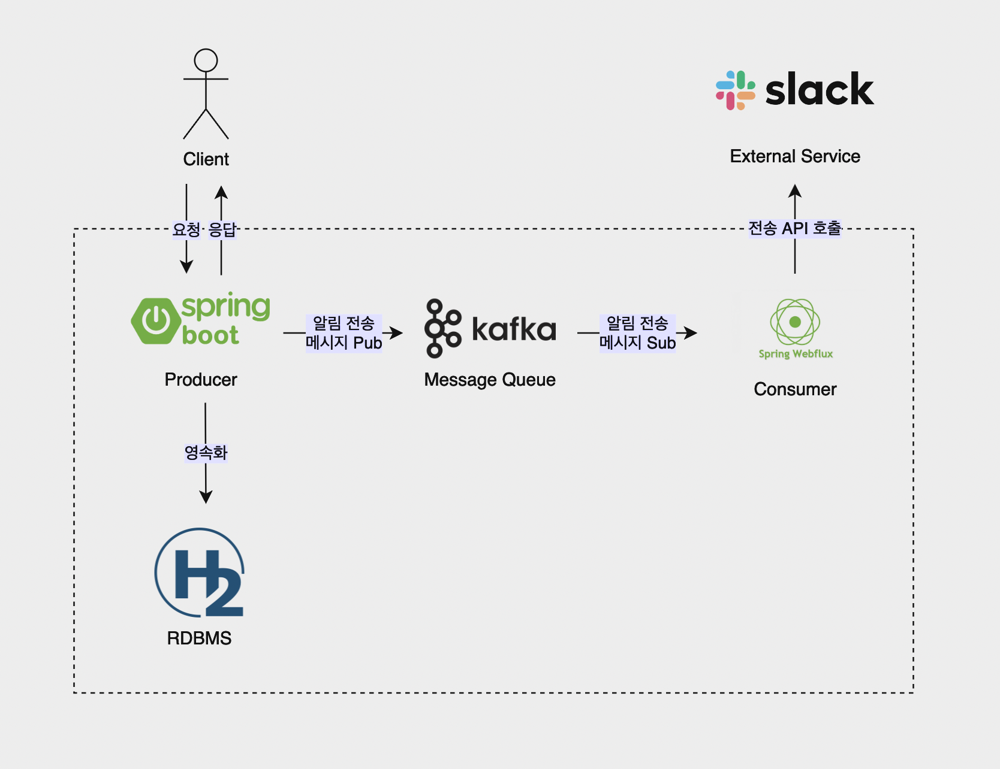

# error-notifier

## 0. 프로젝트 설명 및 목차

> 사용자 알림 그룹 관리 및 실시간 장애 알림 서비스

`error-notifier`는 **알림 대상 목록, 심각도, 장애 내용을 전달 받아 외부 서비스로 장애 알림 메시지를 전송**하기 위한 서비스입니다.

서비스가 제공하는 기능은 다음과 같습니다.
- 사용자 알림 그룹 생성, 가입 및 탈퇴
- Slack 등 외부 서비스로 장애 알림 메시지 전송

<br>

프로젝트는 **멀티 모듈**로 구성되었으며, 모듈 정보는 다음과 같습니다.

1. `common` : 모듈 공통 Utils, DTO 정의
2. `producer` : 장애 알림 전송 요청을 받아 대상자 식별 및 외부 서비스 요청에 필요한 token, channelId를 조회하여 알림 전송 message 발행
3. `consumer` : 알림 전송 message를 구독하여 외부 서비스 메시지 전송 API 호출
4. `mockup` : 외부 서비스(Slack) mockup

<br>

프로젝트 개발에 사용한 기술 스택은 다음과 같습니다.
- Language : `Java 21`
- Framework : `Spring Boot 3.3.3`, `Spring WebFlux`
- DB : `H2 DB`, `Spring Data JPA`, `Flyway`
- Test : `JUnit5`
- MQ : `Spring Kafka`, `Reactor Kafka`
- ETC : `WebClient`, `Log4J2`, `Swagger`, `Docker`

<br>

### 목차
1. [실행 방법](#1-실행-방법)
2. [시스템 아키텍처](#2-시스템-아키텍처)
3. [소프트웨어 아키텍처](#3-소프트웨어-아키텍처)
4. [DB 스키마](#4-db-스키마)
5. [API 명세](#5-api-명세)
6. [라이브러리 및 오픈소스 사용 목적](#6-라이브러리-및-오픈소스-사용-목적)
7. [기타 구현](#7-기타-구현)

<br>

---

## 1. 실행 방법

로컬 실행 환경은 **Docker Compose**로 구성되어있습니다.

Docker 실행 후 프로젝트 root 디렉토리(`/error-notifier`)에서 다음 명령어를 차례로 입력하여 실행할 수 있습니다.

```
./gradlew build

docker compose up
```

<br>

로컬 API 테스트를 진행하는 경우 테스트 데이터를 insert합니다.

> http://localhost:8080/h2-console 접속 후 다음 정보로 접속
> - JDBC URL : jdbc:h2:mem:producer;DATABASE_TO_UPPER=false
> - User Name : sa

```sql
INSERT INTO noti_group
VALUES ('11111111-1111-1111-1111-111111111111', 'group_name1', 'test_desc1', NOW(), NOW()),
       ('22222222-2222-2222-2222-222222222222', 'group_name2', 'test_desc2', NOW(), NOW());

INSERT INTO users
VALUES ('11111111-1111-1111-1111-111111111111', 'user_name1', 'test_token1', 'test_channel_id1', NOW(), NOW()),
       ('22222222-2222-2222-2222-222222222222', 'user_name2', 'test_token2', 'test_channel_id2', NOW(), NOW());

INSERT INTO noti_group_user
VALUES ('11111111-1111-1111-1111-111111111111', '11111111-1111-1111-1111-111111111111',
        '11111111-1111-1111-1111-111111111111', NOW(), NOW());
```

<br>

다음 curl을 실행하여 정상적으로 에러 알림 전송 API를 테스트할 수 있습니다.
```
curl --location 'http://localhost:8080/v1/alerts' \
--header 'Content-Type: application/json' \
--data-raw '{
    "target":["@user_name2","@@group_name1"],
    "severity":"normal",
    "message":"node1 down"
}'
```

<br>

---

## 2. 시스템 아키텍처



장애 알림 메시지 전송 **API 처리량을 높이기 위한 고려**, **서비스 확장에 대한 고려**로 인하여 Message Queue를 사용한 Pub/Sub 모델로 구성했습니다.

<br>

시스템의 전체적인 흐름은 다음과 같습니다.

1. `Producer 모듈`은 알림 그룹 생성, 가입 및 탈퇴 기능을 수행하여 `RDBMS`에 영속화합니다.
2. `Client`에게 알림 전송 요청이 오면, `Producer 모듈`은 `RDBMS`를 조회하여 에러 알림 대상 사용자를 식별하여 `MQ`에 알림 전송 메시지를 발행합니다.
3. `Consumer 모듈`은 `MQ`에서 알림 전송 메시지를 구독하여 Slack 등 `External Service`의 알림 전송 API를 호출합니다.

<br>

해당 아키텍처는 다음과 같은 장점을 갖습니다.

- Producer 모듈은 Slack 등 외부 서비스의 병목과 관계 없이 알림 대상 및 정보를 조회하여 이벤트를 발행하여 **처리량을 늘릴 수 있습니다**.
- 각 모듈의 **독립성이 증가**하며 **scale out이 용이**합니다.
- 장애 발생 시 Kafka에 적재된 데이터는 polling 이후에도 손실되지 않아 **장애 발생 시 재처리가 가능**합니다.
- 추가적인 서비스를 추가해 message를 구독하여 **서비스 확장이 가능**합니다.

<br>

또한 과제의 선택 사항을 만족시킬수 있습니다.

> 1. 장애로 인해 외부 오픈 API 응답이 지연되거나 일시적으로 사용할 수 없는 경우, 장애 전파를 막기 위한 기능을 구현하거나 해결 방안에 대해 상세히 기술해주세요.
>
> 
> 2. 외부 오픈 API가 초 당 처리할 수 있는 양이 제한되어있는 경우, 초과하는 외부 오픈 API 요청을 막기 위한 기능을 구현하거나 해결 방안에 대해 상세히 기술해주세요.

1. 외부 오픈 API 응답과 관계 없이 Producer는 에러 알림 message를 발행할 수 있으며, Client는 Producer에 즉각적인 응답을 받을 수 있기 때문에 장애 전파를 막을 수 있습니다.


2. Consumer 모듈의 polling 주기를 설정하여 어느정도 제한된 처리량에 맞게 조절할 수 있으며, 만약 정확한 초당 처리량을 지켜야 된다면 Leaky Bucket 알고리즘을 사용하여 Rate Limiter를 구현할 것입니다.

---

## 3. 소프트웨어 아키텍처


클린 아키텍처를 지향하기 위하여 **헥사고날 아키텍처**를 사용했으며 **모든 의존성 방향은 Domain**으로 흐릅니다.

> - Input: `Input Adpater` -(`Input Port`)> `Application Service` -> `Domain`
> - Output: `Domain` <- `Application Service` <(`Output Port`)- `Output Adapter`

<br>

**Domain은 Infrastructure의 어떤 의존성도 가지지 않으며**, Domain과 Infrastructure는 Port & Adapter로 분리되어 있기 때문에 **외부 의존성을 Domain 코드 변경 없이 쉽게 교체**할 수 있습니다.

만약 외부 의존성의 변경 혹은 로직의 변경이 필요하다면 다른 Adpater로 교체하거나, Adapter의 코드만 수정합니다.

<br>

간략한 디렉토리 구조는 다음과 같습니다. (Producer 모듈 예시)

```
producer
├── common
│   ├── config
│   └── web
│       ├── aop
│       ├── exception
│       └── filter
└── notification
    ├── adapter
    │   ├── in
    │   │   └── web
    │   │       └── dto
    │   └── out
    │       ├── persistence
    │       │   └── jpa
    │       │       ├── entity
    │       │       └── repository
    │       └── queue
    │           └── kafka
    ├── application
    │   ├── in
    │   │   └── command
    │   └── out
    └── domain
```

<br>

---

## 4. DB 스키마

DB는 장애 알림 서비스 특성상 CRUD 모두 빈번히 일어나지 않고, N:M의 스키마 구조 특성상 중복 데이터를 피하기 위해 RDBMS를 사용했습니다. (H2 DB 사용)

만약 Producer 모듈의 레이턴시가 DB로 인해 증가하거나 DB에 병목이 생긴다면, read-write 분리와 로컬 캐시 혹은 Redis와 같은 분산 캐시 사용으로 해결할 수 있습니다.

<br>

스키마는 `users 테이블`과 `noti_group 테이블`이 N:M 관계를 가지기 위해서 중계 테이블인 `noti_group_user 테이블`을 사용했으며, Flyway로 관리했습니다.


```sql
# V1__init.sql

CREATE TABLE IF NOT EXISTS users (
    id UUID PRIMARY KEY,
    name VARCHAR(30) NOT NULL UNIQUE,
    token VARCHAR(2048) NOT NULL,
    channel_id VARCHAR(200) NOT NULL,
    created_at TIMESTAMP NOT NULL DEFAULT CURRENT_TIMESTAMP,
    updated_at TIMESTAMP NOT NULL DEFAULT CURRENT_TIMESTAMP ON UPDATE CURRENT_TIMESTAMP
    );

CREATE TABLE IF NOT EXISTS noti_group (
    id UUID PRIMARY KEY,
    name VARCHAR(30) NOT NULL UNIQUE,
    desc VARCHAR(200) NOT NULL,
    created_at TIMESTAMP NOT NULL DEFAULT CURRENT_TIMESTAMP,
    updated_at TIMESTAMP NOT NULL DEFAULT CURRENT_TIMESTAMP ON UPDATE CURRENT_TIMESTAMP
    );

CREATE TABLE IF NOT EXISTS noti_group_user (
    id UUID PRIMARY KEY,
    noti_group_id UUID NOT NULL,
    user_id UUID NOT NULL,
    created_at TIMESTAMP NOT NULL DEFAULT CURRENT_TIMESTAMP,
    updated_at TIMESTAMP NOT NULL DEFAULT CURRENT_TIMESTAMP ON UPDATE CURRENT_TIMESTAMP,
    FOREIGN KEY (noti_group_id) REFERENCES noti_group(id) ON DELETE CASCADE,
    FOREIGN KEY (user_id) REFERENCES users(id) ON DELETE CASCADE,
    CONSTRAINT unique_combination UNIQUE (noti_group_id, user_id)
    );
```

<br>

---

## 5. API 명세

> Swagger UI : 실행 후 http://localhost:8080/swagger-ui/index.html# 접속
> 
> Open API 명세 : [Open API 3.0.1 명세](readmesource/open-api.md)

<br>

### 알림 그룹 생성 API

>요청한 정보로 알림 그룹 생성

Request : POST /v1/noti-groups application/json
```json
{
  "name": "string",
  "desc": "string"
}
```
Response : 201 Created application/json
```json
{
  "id": "3fa85f64-5717-4562-b3fc-2c963f66afa6",
  "name": "string",
  "desc": "string",
  "users": [
    {
      "id": "3fa85f64-5717-4562-b3fc-2c963f66afa6",
      "name": "string",
      "token": "string",
      "channelId": "string"
    }
  ]
}
```

<br>

### 알림 그룹 가입 API

> 사용자가 알림 그룹에 가입

Request : POST /v1/noti-groups/subscribe application/json
```json
{
  "notiGroupId": "3fa85f64-5717-4562-b3fc-2c963f66afa6",
  "userId": "3fa85f64-5717-4562-b3fc-2c963f66afa6"
}
```
Response : 204 No Content

<br>

### 알림 그룹 탈퇴

> 사용자가 알림 그룹에서 탈퇴

Request : POST /v1/noti-groups/unsubscribe application/json
```json
{
  "notiGroupId": "3fa85f64-5717-4562-b3fc-2c963f66afa6",
  "userId": "3fa85f64-5717-4562-b3fc-2c963f66afa6"
}
```
Response : 204 No Content

<br>

### 알림 이벤트 발행

> 알림 전송 대상 사용자 식별 및 알림 이벤트 발행

Request : POST /v1/alerts application/json
```json
{
  "target": [
    "string"
  ],
  "severity": "string",
  "message": "string"
}
```
Response : 200 OK application/json
```json
{
  "userCount": 0
}
```

<br>

---

## 6. 라이브러리 및 오픈소스 사용 목적

> 기술스택은 [0. 프로젝트 설명 및 목차](#0-프로젝트-설명-및-목차)에 설명되어 있으며, 앞서 충분히 설명된 요소는 생략했습니다. 

### Java 21 & Spring Boot 3.3.3

추후 가상스레드를 사용한 성능 향상의 가능성을 염두에 두어 사용했습니다.

### Spring WebFlux

외부 서비스 호출에 중점적인 Consumer 모듈의 특성을 고려하여 비동기 I/O를 사용한 성능 향상 및 자원의 효율성을 위해 WebFlux를 사용했습니다.

### Flyway

마이그레이션 자동화 및 DB 스키마 변경 이력을 남기기 위해 사용했습니다.

### Docker

로컬 실행 환경을 단순화 하기 위해 Docker Compose를 사용했습니다.

<br>

---

## 7. 기타 구현

- GTID를 포함한 request, response 및 각종 에러 및 정보 logging
- AOP를 사용한 공통 Response Format 처리
- CustomException, ExceptionHandler를 사용한 Exception 처리 간편화
- 통합 테스트 및 유닛 테스트

<br>

---

